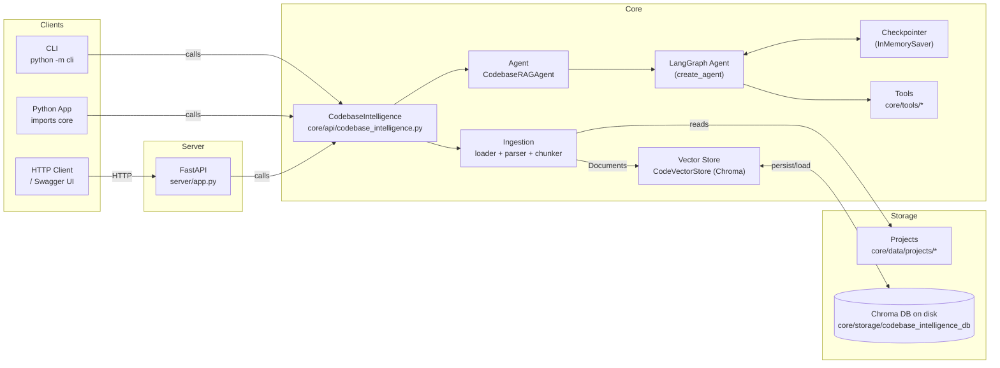

# AI Agent — Codebase Intelligence

Codebase Q&A over local projects using LangChain + LangGraph + Chroma.

- **core**: importable library (`CodebaseIntelligence`)
- **server**: FastAPI REST API
- **cli**: interactive terminal interface

## What it does

1. Loads code from `core/data/projects/`
2. Chunks and embeds it into a persistent Chroma DB (`core/storage/codebase_intelligence_db/`)
3. Answers questions with conversation memory (via `conversation_id`)

## Requirements

- Python 3.10+
- An OpenAI API key **only when building embeddings** (first run or `force_reload=True`)

## Install

```bash
python -m venv .venv
.venv\Scripts\activate
pip install -r requirements.txt
```

Set your key (Windows PowerShell):

```powershell
setx OPENAI_API_KEY "sk-..."
```

## Run

### API server

```bash
python -m server
```

Open Swagger UI:

- <http://localhost:8000/docs>

### CLI

```bash
python -m cli
```

## Architecture

For the full write-up, see [docs/ARCHITECTURE.md](docs/ARCHITECTURE.md).



## Core library usage

`initialize()` and `query()` are async.

```python
import asyncio
from core import CodebaseIntelligence


async def main() -> None:
    system = CodebaseIntelligence(model_name="gpt-5-nano")
    await system.initialize(force_reload=False)

    answer = await system.query(
        "How does the FastAPI server start?",
        conversation_id="demo",
    )
    print(answer)


asyncio.run(main())
```

## API overview

For the full API reference, see [docs/API.md](docs/API.md).

- `POST /query` — ask a question (optionally pass `conversation_id`)
- `GET /conversations` — list known conversations
- `GET /conversations/{conversation_id}/history` — retrieve message history
- `GET /conversations/{conversation_id}/summary` — quick stats
- `DELETE /conversations/{conversation_id}` — clear a conversation

Note: conversation state is stored in-memory (lost on process restart).

## Tests

```bash
pytest
```
