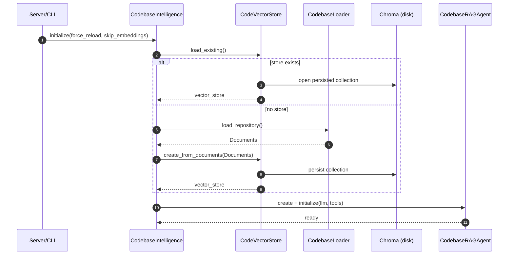
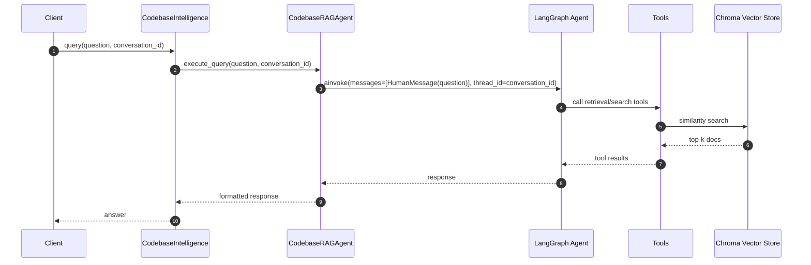

# Architecture

This project is a small “codebase intelligence” system that:

1. Reads local codebases from `core/data/projects/`
2. Chunks them into documents with metadata
3. Builds (or loads) a persistent Chroma vector store at `core/storage/codebase_intelligence_db/`
4. Answers questions using a LangGraph agent (RAG over the vector store)
5. Tracks multi-turn context via `conversation_id` using a LangGraph checkpointer

## High-level component diagram

```mermaid
flowchart LR
  subgraph Clients
    CLI[CLI\npython -m cli]
    HTTP[HTTP Client\n/ Swagger UI]
    PY[Python App\nimports core]
  end

  subgraph Server
    FASTAPI[FastAPI\nserver/app.py]
  end

  subgraph Core
    CI[CodebaseIntelligence\ncore/api/codebase_intelligence.py]
    ING[Ingestion\nloader + parser + chunker]
    VS[Vector Store\nCodeVectorStore (Chroma)]
    AG[Agent\nCodebaseRAGAgent]
    LG[LangGraph Agent\n(create_agent)]
    CP[Checkpointer\n(InMemorySaver)]
    TOOLS[Tools\ncore/tools/*]
  end

  subgraph Storage
    PROJ[Projects\ncore/data/projects/*]
    CHROMA[(Chroma DB on disk)\ncore/storage/codebase_intelligence_db]
  end

  CLI -->|calls| CI
  PY -->|calls| CI
  HTTP -->|HTTP| FASTAPI -->|calls| CI

  CI --> ING -->|Documents| VS
  VS <-->|persist/load| CHROMA
  ING -->|reads| PROJ

  CI --> AG --> LG
  LG --> TOOLS
  LG <--> CP
```

## Module responsibilities

### `core/api/codebase_intelligence.py`

`CodebaseIntelligence` is the main “black box” API.

Responsibilities:

- Maintains the projects root: `core/data/projects/`
- Maintains the vector DB root: `core/storage/codebase_intelligence_db/`
- Orchestrates startup indexing via `initialize(force_reload=False, skip_embeddings=False)`
- Orchestrates question answering via `query(question, conversation_id)`
- Exposes conversation inspection helpers (`get_conversation_history`, `list_conversations`, etc.)

### `core/ingestion/*`

Transforms source trees into documents suitable for embedding and retrieval.

Key idea: ingestion attaches metadata (repo-relative path, language, etc.) so retrieval can cite where context came from.

### `core/storage/vector_store.py`

Wraps the persistent Chroma collection.

Typical responsibilities:

- Create a new store from documents
- Load an existing persisted store
- Provide similarity search over stored embeddings

Persistent store location:

- `core/storage/codebase_intelligence_db/`

### `core/agents/*`

Builds the agent used to answer questions:

- LLM configuration
- Tool wiring (retrieval/search)
- LangGraph graph/checkpointer integration

### `core/tools/*`

Tooling layer used by the agent (e.g., codebase search / retrieval helpers).

### `server/app.py`

FastAPI app exposing `CodebaseIntelligence` over HTTP.

Key endpoints:

- `GET /health`
- `GET /status`
- `POST /query`
- Conversation endpoints under `/conversations/*`

### `cli/main.py`

Interactive local loop for running queries and inspecting conversation state.

## Runtime flows

### 1) Startup + indexing flow

When you start the server (`python -m server`) or the CLI and call `initialize()`:



### 2) Query (RAG) flow

For each `query(question, conversation_id)`:



## Conversation memory and checkpoints

The system uses `conversation_id` as LangGraph `thread_id`.

Conceptually:

- History: message list
- State: full checkpoint payload
- Summary: counts and previews

Current behavior:

- Uses an in-memory checkpointer (`InMemorySaver`) for conversation state
- Conversation state will not persist across process restarts

If you need persistence across restarts, the checkpointer should be replaced with a persistent implementation (for example, a SQLite-backed saver), and the conversation endpoints should read from that persistent store.

## Files and data directories

- `core/data/projects/`: local repositories/projects you want indexed
- `core/storage/codebase_intelligence_db/`: persisted Chroma DB (vector store)
- `docs/`: project documentation

## Operational notes

- Logging: Uvicorn may override logging defaults; the server config forces app/core loggers on.
- Indexing cost: initial embedding/indexing can take time depending on repo size.

